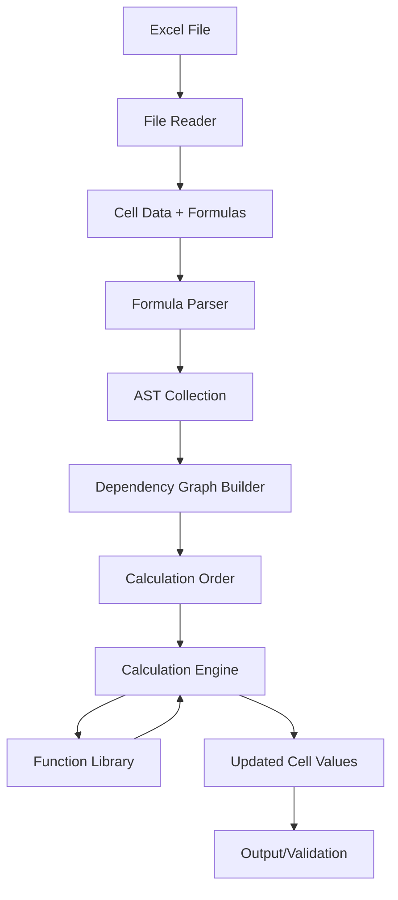

# Excel Formula Engine - System Architecture

## Overview

The Excel Formula Engine is designed to parse, analyze, and evaluate Excel formulas with behavior matching Microsoft Excel. The system consists of five core components working together in a pipeline.

## Core Components

### 1. Excel File Reader
**Responsibility**: Load Excel files and extract cell data

**Key Features**:
- Read `.xlsx`, `.xls`, and `.xlsm` files
- Extract cell values, formulas, and metadata
- Preserve cell references and named ranges
- Handle multiple worksheets

**Recommended Libraries**:
- **Python**: `openpyxl`, `xlrd`
- **JavaScript**: `xlsx` (SheetJS), `exceljs`
- **Java**: Apache POI
- **C#**: EPPlus, ClosedXML
- **Rust**: `calamine`, `umya-spreadsheet`

### 2. Formula Parser
**Responsibility**: Convert formula strings into Abstract Syntax Trees (AST)

**Key Features**:
- Tokenize formula strings
- Handle operator precedence
- Parse function calls with arguments
- Support cell references (A1, R1C1 notation)
- Handle range references (A1:B10)
- Support named ranges
- Parse array formulas

**Grammar Elements**:
```
Formula     → Expression
Expression  → Term (('+' | '-') Term)*
Term        → Factor (('*' | '/') Factor)*
Factor      → Number | CellRef | Function | '(' Expression ')'
Function    → Identifier '(' Arguments? ')'
Arguments   → Expression (',' Expression)*
CellRef     → [Sheet!]ColumnRow | [Sheet!]R1C1
Range       → CellRef ':' CellRef
```

**Example AST for `=SUM(A1:A10) + B1 * 2`**:
```
BinaryOp(+)
├── FunctionCall(SUM)
│   └── Range(A1:A10)
└── BinaryOp(*)
    ├── CellRef(B1)
    └── Number(2)
```

### 3. Dependency Graph Builder
**Responsibility**: Analyze formula dependencies and determine calculation order

**Key Features**:
- Build directed acyclic graph (DAG) of cell dependencies
- Detect circular references
- Topological sort for calculation order
- Handle volatile functions (NOW, RAND, etc.)
- Support iterative calculation for circular refs (optional)

**Algorithm**:
1. Parse all formulas in workbook
2. Extract cell references from each formula
3. Build dependency edges: `formula_cell → referenced_cell`
4. Perform topological sort using Kahn's algorithm or DFS
5. Detect cycles and handle appropriately

**Data Structure**:
```
DependencyGraph {
    nodes: Map<CellAddress, CellNode>
    edges: Map<CellAddress, Set<CellAddress>>
    calculation_order: List<CellAddress>
}
```

### 4. Calculation Engine
**Responsibility**: Execute formulas in correct order and manage state

**Key Features**:
- Evaluate AST nodes recursively
- Maintain cell value cache
- Handle recalculation triggers
- Support lazy evaluation
- Manage calculation context (current cell, workbook state)
- Handle errors (#DIV/0!, #VALUE!, #REF!, etc.)

**Evaluation Strategy**:
1. Start with cells having no dependencies (constants)
2. Follow topological order from dependency graph
3. For each cell:
   - Retrieve cached values for dependencies
   - Evaluate formula AST
   - Store result in cache
   - Propagate to dependent cells

**Context Management**:
```
CalculationContext {
    workbook: Workbook
    current_cell: CellAddress
    value_cache: Map<CellAddress, Value>
    iteration_count: int
    precision: float
}
```

### 5. Function Library
**Responsibility**: Implement Excel functions

**Categories**:

#### Mathematical Functions
- `SUM`, `AVERAGE`, `MIN`, `MAX`, `COUNT`
- `ROUND`, `ROUNDUP`, `ROUNDDOWN`, `FLOOR`, `CEILING`
- `ABS`, `SQRT`, `POWER`, `EXP`, `LN`, `LOG`
- `MOD`, `QUOTIENT`, `PRODUCT`, `SUMPRODUCT`

#### Statistical Functions
- `MEDIAN`, `MODE`, `STDEV`, `VAR`
- `PERCENTILE`, `QUARTILE`, `RANK`
- `CORREL`, `COVAR`

#### Logical Functions
- `IF`, `AND`, `OR`, `NOT`, `XOR`
- `IFERROR`, `IFNA`, `IFS`
- `TRUE`, `FALSE`

#### Text Functions
- `CONCATENATE`, `CONCAT`, `TEXTJOIN`
- `LEFT`, `RIGHT`, `MID`, `LEN`
- `UPPER`, `LOWER`, `PROPER`, `TRIM`
- `FIND`, `SEARCH`, `REPLACE`, `SUBSTITUTE`
- `TEXT`, `VALUE`

#### Date/Time Functions
- `TODAY`, `NOW`, `DATE`, `TIME`
- `YEAR`, `MONTH`, `DAY`, `HOUR`, `MINUTE`, `SECOND`
- `DATEDIF`, `EDATE`, `EOMONTH`
- `WEEKDAY`, `WORKDAY`, `NETWORKDAYS`

#### Lookup/Reference Functions
- `VLOOKUP`, `HLOOKUP`, `LOOKUP`
- `INDEX`, `MATCH`, `XLOOKUP` (Excel 365)
- `OFFSET`, `INDIRECT`, `CHOOSE`
- `ROW`, `COLUMN`, `ROWS`, `COLUMNS`

#### Information Functions
- `ISBLANK`, `ISERROR`, `ISNA`, `ISNUMBER`, `ISTEXT`
- `TYPE`, `CELL`, `INFO`

## Data Flow



## Key Design Decisions

### 1. Error Handling
Excel has specific error types that must be preserved:
- `#DIV/0!` - Division by zero
- `#N/A` - Value not available
- `#NAME?` - Unrecognized function/name
- `#NULL!` - Incorrect range operator
- `#NUM!` - Invalid numeric value
- `#REF!` - Invalid cell reference
- `#VALUE!` - Wrong type of argument

### 2. Type Coercion
Excel performs implicit type conversions:
- Numbers stored as text → convert to number in calculations
- Boolean TRUE = 1, FALSE = 0 in arithmetic
- Empty cells = 0 in arithmetic, "" in text operations
- Dates are numbers (days since 1900-01-01)

### 3. Precision and Rounding
- Excel uses IEEE 754 double-precision (15 significant digits)
- Some functions have specific rounding behaviors
- Comparison operations have precision tolerance

### 4. Volatile Functions
Functions like `NOW()`, `RAND()`, `OFFSET()` recalculate on every change:
- Mark cells containing volatile functions
- Always recalculate these cells
- Propagate to dependents

### 5. Array Formulas
Excel supports array formulas (Ctrl+Shift+Enter):
- Single formula produces multiple values
- Spill behavior in Excel 365
- Legacy array formula handling

## Performance Considerations

### Optimization Strategies

1. **Lazy Evaluation**
   - Only recalculate changed cells and dependents
   - Cache intermediate results

2. **Parallel Calculation**
   - Independent branches can be calculated in parallel
   - Thread-safe value cache

3. **Incremental Updates**
   - When cell changes, only recalculate affected subgraph
   - Maintain dirty flags

4. **Memory Management**
   - Stream large files instead of loading entirely
   - Release AST after compilation to bytecode (optional)

## Testing Strategy

### Unit Tests
- Test each function against Excel's behavior
- Edge cases: empty cells, errors, type mismatches
- Precision tests for floating-point operations

### Integration Tests
- Real Excel files with known results
- Complex dependency chains
- Circular reference handling

### Compatibility Tests
- Compare results with actual Excel output
- Test files from different Excel versions
- Cross-platform consistency

## Extension Points

### Custom Functions
Allow users to register custom functions:
```
register_function("CUSTOM_FUNC", custom_implementation)
```

### Custom Operators
Support additional operators beyond Excel's standard set

### Plugins
- Custom file format readers
- Alternative calculation strategies
- Performance profilers

## Implementation Phases

### Phase 1: Core Infrastructure (Week 1-2)
- File reader integration
- Basic parser for simple formulas
- Simple dependency graph
- Basic calculation engine

### Phase 2: Essential Functions (Week 3-4)
- Mathematical functions
- Logical functions
- Basic text functions
- Date/time basics

### Phase 3: Advanced Features (Week 5-6)
- Lookup functions
- Array formulas
- Named ranges
- Error handling refinement

### Phase 4: Optimization (Week 7-8)
- Performance profiling
- Caching strategies
- Parallel calculation
- Memory optimization

### Phase 5: Validation (Week 9-10)
- Comprehensive test suite
- Excel compatibility testing
- Documentation
- Examples and tutorials

## Success Metrics

1. **Correctness**: 95%+ match with Excel results on test suite
2. **Coverage**: Support 100+ most common Excel functions
3. **Performance**: Process 10,000 cell workbook in < 1 second
4. **Reliability**: Handle edge cases and errors gracefully

## References

- [Microsoft Excel Formula Documentation](https://support.microsoft.com/en-us/excel)
- [OpenFormula Specification](https://docs.oasis-open.org/office/v1.2/OpenDocument-v1.2-part2.html)
- Existing implementations: HyperFormula, fast-formula-parser, XLParser
